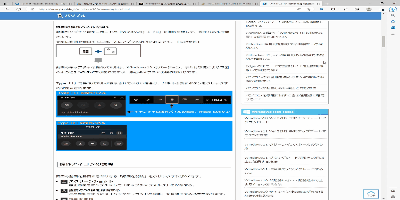

---
html:
  embed_local_images: true
---

# Sample Markdown

## 目次

<!-- @import "[TOC]" {cmd="toc" depthFrom=1 depthTo=3 orderedList=false} -->

<!-- code_chunk_output -->

- [Sample Markdown](#sample-markdown)
  - [目次](#目次)
  - [テーブル](#テーブル)
  - [図](#図)
  - [コードブロック](#コードブロック)
  - [注釈](#注釈)
    - [脚注](#脚注)
    - [脚注の内容](#脚注の内容)
  - [Markdown内にMarkdownを挿入](#markdown内にmarkdownを挿入)
- [Markdown Preview Enhanced](#markdown-preview-enhanced)
  - [Math typesetting](#math-typesetting)
  - [Diagrams](#diagrams)
  - [Code Chunk](#code-chunk)
    - [GNUPlot](#gnuplot)
    - [LaTeX](#latex)
    - [Python matplotlib](#python-matplotlib)
  - [Import external files](#import-external-files)
  - [You can even create presentation!](#you-can-even-create-presentation)

<!-- /code_chunk_output -->

---

* マークダウン記述方法は[こちら](https://www.markdownguide.org/cheat-sheet/)を参照

---

## テーブル

| Property | Earth |          |
| -------- | ----- | -------- |
| Q        | min   | -89.2 °C |
| ^        | mean  | 14 °C    |
| ^        | min   | 56.7 °C  |


* リンクを貼りたい場合、htmlで記述

<table id='great_table'>
  <thead>
    <tr>
      <th>Property</th>
      <th>Earth</th>
      <th></th>
    </tr>
  </thead>
  <tbody>
    <tr>
      <td>Q</td>
      <td>min</td>
      <td>-89.2 °C</td>
    </tr>
    <tr>
      <td>^</td>
      <td>mean</td>
      <td>14 °C</td>
    </tr>
    <tr>
      <td>^</td>
      <td>min</td>
      <td>56.7 °C</td>
    </tr>
  </tbody>
</table>

[テーブルリンク](#great_table)

---

## 図


* 中央配置
<div style="text-align: center;">


</div>


* GIFの挿入


---

## コードブロック

```ruby
puts 'The best way to log and share programmers knowledge.'
```
---

## 注釈
### 脚注 
- サンプル文章[^footnote_sample]
- サンプル文章2[^footnote_sample2]

### 脚注の内容

* htmlの際はドキュメント一番下に表示

[^footnote_sample]: 脚注の内容
[^footnote_sample2]: 脚注2の内容

---

## Markdown内にMarkdownを挿入

* Github上のファイルも挿入できる

[文書へのアクセスはこちら](https://github.com/shd101wyy/markdown-preview-enhanced/blob/master/test/demo.md)

@import "https://github.com/shd101wyy/markdown-preview-enhanced/blob/master/test/demo.md"

---
<style>
body {
    counter-reset: h2;
}
h1 {
    padding: 5px;
}
h2 {
    counter-reset: h3;
}
h2:before {
    counter-increment: h2;
    content: counter(h2) ". ";
}
h3:before {
    counter-increment: h3;
    content: counter(h2) "." counter(h3) ". ";
}
table {
    border-collapse: collapse;
}

</style>